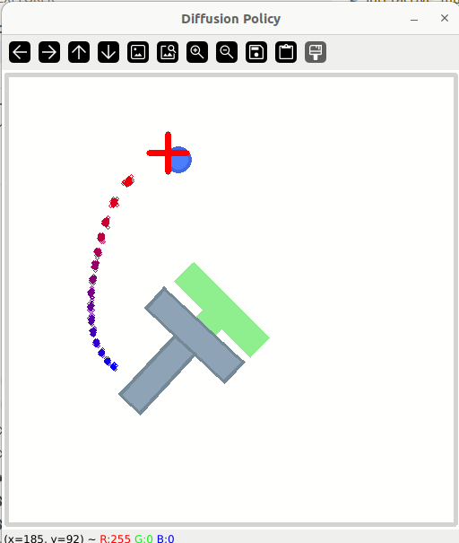

In this little experiment I wanted to really get a feel for the multi-modality (in the sense of probability distributions) of generative imitation learning policies like [Diffusion Policy (DP)](https://arxiv.org/abs/2303.04137) and [Action Chunking Transformers (ACT)](https://arxiv.org/abs/2304.13705).

**TLDR**: At least in the PushT environment. These models do not produce multi-modal action trajectory distributions! Furthermore, the distributions seem to be much sharper than one might expect. Adding small gaussian noise to the observations is a better means of producing multimodality, and can be used to the same effect with discriminative models like ACT trained without the variational objective.

### Quick background

I'm assuming you know about DP and ACT so I'll just very quickly jog your memory:

**ACT** - ACT uses a conditional variational auto-encoder during training and just the decoder during inference.

**Diffusion Policy** - Diffusion Policy uses diffusion modeling.

**PushT** - PushT is a nice simulation environment for quick prototyping. The goal is to use a cylindrical end-effector tor prod a T-shaped block around and try to get it onto a T-shaped target. I used it because it's 2D, and therefore easy to visualize.

### Visualizing multi-modality

The following GIF shows a trained diffusion policy being rolled out on a PushT environment. It also visualizes the action trajectory returned by the policy with a red->blue gradient to indicate the flow of the trajectory. Inference is rerun when the trajectory is depleted.

This next GIF does the same thing, but ~100 action trajectories are generated and visualized at each inference step (where one of them is picked randomly for the actual rollout, and 99 are not used but just visualized). This is to get a monte-carlo view of the "distribution".

We do see some spread in the distribution but it mostly looks uni-modal and sharp.

To take things further, I wanted full control over where I'll run inference rather than being at the whim of the where the policy wants to go. So I rigged things up so that I could control the robot with mouse input. Then I ran inference on _every_ step. That way I could explore, and purposefully manufacture scenarios where multi-modality _should_ arise. In the following set of GIFs I do just that, with DP and ACT side-by-side.

*Note: The official DP implementation uses 2 steps worth of observation history. Here I just take the current step and copy it back to the previous step, effectively just using one step of history.*

*Note: The official ACT implementation uses a zero-vector for the latent at inference time to get deterministic rollouts. Here I do sampling from the standard normal distribution instead.*

Here's one where I just try to do the task of pushing the T onto the target. Here we do see some wider distributions produced by DP.

Next, I set up a scenario where we would expect bi-modal distributions. There are a few interesting observations here:
1. The DP distribution seems to be much smoother (or spread out) than the ACT distribution.
2. ACT seems to switch modes sooner than DP, indicating some form of relative bias between the two models.
3. Both distributions actually look uni-modal all the way, whereas I would have expected a transition from uni-modal, to bi-modal, back to uni-modal. Also related to this is that the trajectories that seem to hedge between the two modes look like they are bad trajectories!
4. For both models, there seems to be a bias to going around the T in a counter-clockwise direction over a clockwise direction. This might say something about the way the demonstration data was collected (I believe the demonstration data was made by human teleoperators).

I also observed that the policies can be quite stubborn about committing to a mode when there is clearly more than one way to solve the problem. Watch that happening in this GIF. Again, we see a heavy bias towards counter-clockwise motion.

Finally, what might be interesting, is to add noise to the proprioceptive state and T keypoints (I didn't mentions so far, but these policies use 8 keypoints from the T-block rather than raw input images). In the GIF below we do see truly multi-modal looking distributions. But I think this would have been true with a policy trained on a vanilla MSE objective (_it was just interesting to try anyway_).

Just to drive that last point home, here's an ACT policy trained without a VAE objective but with noised state vectors. It looks much like the GIF above. One interesting observation I'll make here is that perhaps it's sufficient to have noisy inputs to get the sort of multi-modality we are looking for.

_Maybe_ generative modelling is not actually necessary. I've heard anecdotal evidence of this from other researchers in the field. Also, my colleagues at LeRobot conducted some ablation experiments showing that they couldn't get an improvement by using the VAE objective (see the report [here](https://wandb.ai/marinabar/lerobot/reports/CVAE-in-the-ACT-policy---Vmlldzo4NDkwMzkx?accessToken=1g8hfcgyfzonhwbjg056oqa5excp4mk4cz53bit5vrm5pvdgh4sebg0994df3mpa)).

### What to make of all this

Regarding the underwhelmingly uni-modal distributions generated by ACT and DP, I'm really not that sure. I think I would like more control over the way the demonstration data is generated to make sure I can tell the difference between: (a) the policy is not learning the distribution in all its diversity, (b) the demo data distribution having its own quirks which are reflected in the policy. It might also be interesting to think of ways of visualizing these action trajectory distributions in 3D environments where we might expect more multi-modality.

Based on the experiments where I tried noising the observations and saw what really did look like multi-modality, I'm leaning towards thinking that generative modeling is not necessary. I wouldn't put all my chips on that bet, but it's certainly something I'll be keeping top of mind in the months to come.

### Bonus visualizations

One thing that I briefly noted above is that DP is actually set up to take the current observation, and one from the preceding timestep (two consecutive observations all up). I'd been actually just cloning the current observation into the previous timestep as well (for easier comparison with ACT, which only uses the current observation). Watch what happens if I actually use the previous observation. We see that the distribution doesn't just depend on the current position, but also on the velocity of the robot end-effector. Watch as I make sudden movements that cause the distribution to switch modes momentarily before settling back to its default state with no velocity prior. Clearly, using an observation history makes a difference!

With this setup, I wanted to double check a point I made earlier: "trajectories that seem to hedge between the two modes look like they are bad trajectories". Here I set up some "bad" trajectories and try to follow them. It looks like I can't go far down the "bad" path without the policy returning a more sensible trajectory. I tried this a few times and always found that eventually the policy would get back on track.

Finally, I also tried an experiment with [VQ-BeT](https://sjlee.cc/vq-bet/simulated_index.html). This is a GPT-style transformer that predicts action tokens. The "multi-modality" comes from the fact that it predicts a categorical distribution over possible tokens and we use multinomial sampling to select one. We can definitely see the multinomial nature of the multimodality in the GIF below! 

What's very cool about VQ-BeT is that the action tokens are learned with a VQ-VAE, so we are looking at purely learned modes in the GIF above 🤓.

---

## Appendix: Reproducibility

All visualizations were run with [this branch of LeRobot](https://github.com/alexander-soare/lerobot/tree/experiment_multimodal_actions). You can run the setup as according the LeRobot's main README.

You can play around with the visualization tool by running `python lerobot/scripts/interactive_multimodality`. I've left a docstring up the top about how to use it. The pretrained policies I've used are all up in the HuggingFace hub and referenced in that script.