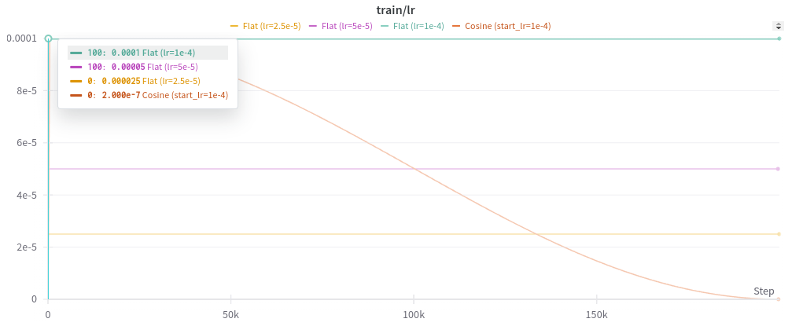
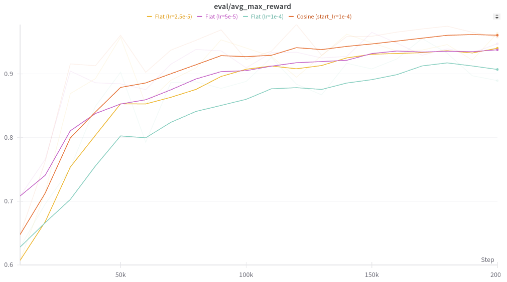
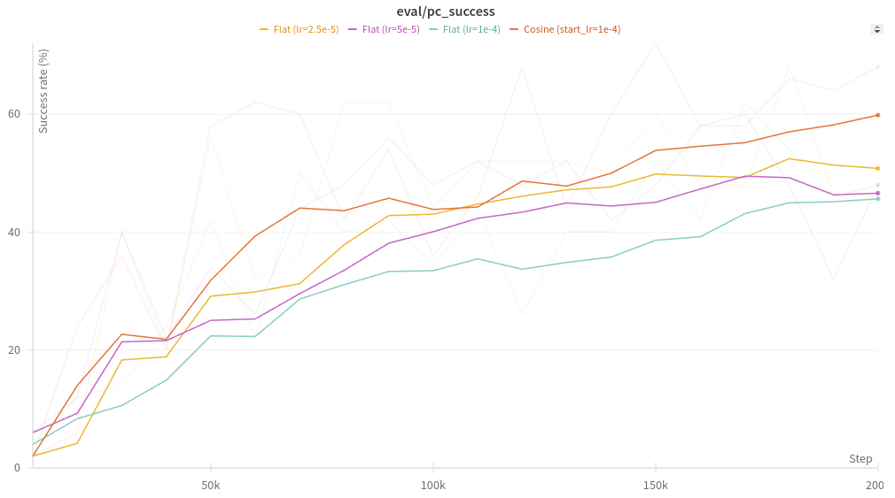

In this experiment I wanted to see if, for Diffusion Policy trained on the PushT environment, using a (cosine) learning rate scheduler would have any benefits over using a flat learning rate throughout training. 

**TLDR**: At least in this setting, the LR scheduler appears to help!

Here's what the LR looks like for each of my experiments (200k training steps):



There are two evaluation metrics on a per-episode basis:

- Maximum overlap with target (seen as `eval/avg_max_reward` in the charts above). This ranges in [0, 1].
- Success: whether or not the maximum overlap is at least 95%.

Here's what the overlap metric looks like (50 evaluations per point with random initializations, plot lines are smoothed):



Here's what the success rate looks like (50 evals per point with random initializations, plot lines are smoothed)



We're clearly seeing that the training run with the cosine scheduler seems to outperform the others. We also get a hint that a flat LR of 1e-4 might be a bit high.

Here are the metrics for 500 episodes worth of evaluation. For the success rate I added an extra row with confidence bounds (see [beta_distribution.md](./beta_distribution.md) for details on how I compute these).

<blank>|Cosine (1e-4)|Flat (1e-4)|Flat (5e-4)|Flat (2.5e-4)
-|-|-|-|-
Average max. overlap ratio | 0.952 | 0.923 | 0.918 | 0.935
Success rate for 500 episodes (%) | 56.0 | 39.2 | 33.8 | 36.4
Beta distribution lower/mean/upper (%) | 53.8 / 56.0 / 58.2 | 37.1 / 39.2 / 41.4 | 31.8 / 33.9 / 36.0 | 34.3 / 36.5 / 38.6

---

<div style="color:#555555">

## Appendix Reproducibility

The experiments were conducted on [this branch of the LeRobot library](https://github.com/alexander-soare/lerobot/tree/experiment_lr_scheduler).

The results were logged to WandB. You may view them [here](https://wandb.ai/alexander-soare/lerobot?nw=j3ce4d3ypq8).

The training commands were all variations of:

```python
python lerobot/scripts/train.py \
    hydra.job.name=$JOB_NAME \
    hydra.run.dir=/fsx/$USER/outputs/train/${now:%Y-%m-%d}/${now:%H-%M-%S}_${JOB_NAME} \
    env=pusht \
    policy=diffusion \
    training.save_checkpoint=true \
    training.offline_steps=200000 \
    training.save_freq=20000 \
    training.eval_freq=10000 \
    training.log_freq=50 \
    training.lr_scheduler=null \
    eval.n_episodes=50 \
    eval.batch_size=50 \
    wandb.enable=true \
    wandb.disable_artifact=true \
    device=cuda \
    use_amp=true
```

where I've used:
- `training.lr_scheduler=cosine training.lr=1e-4`
- `training.lr_scheduler=null training.lr=1e-4`
- `training.lr_scheduler=null training.lr=5e-5`
- `training.lr_scheduler=null training.lr=2.5e-5`

For the 500 evaluations used to produce the table, I sped things up a bit by using DDIM with 10 inference steps:

```bash
python lerobot/scripts/eval.py \
    -p checkpoint_dir/last/pretrained_model \
    eval.n_episodes=500 \
    eval.batch_size=50 \
    eval.use_async_envs=true \
    policy.noise_scheduler_type=DDIM \
    policy.num_inference_steps=10
```

</div>