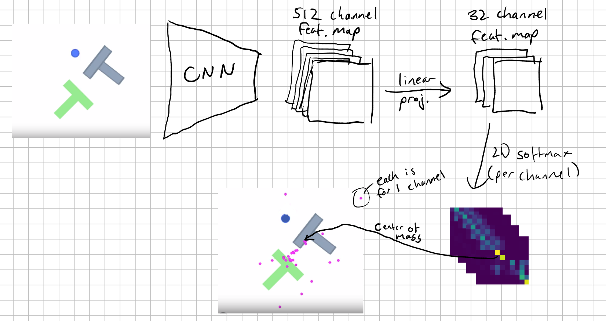
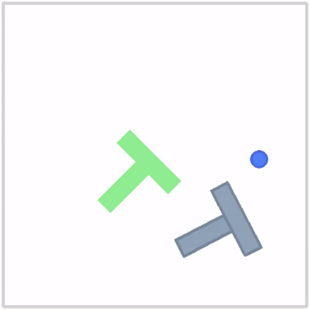
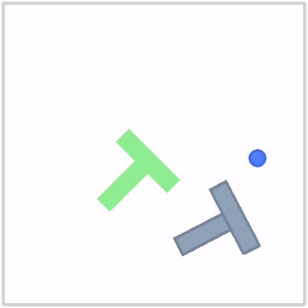
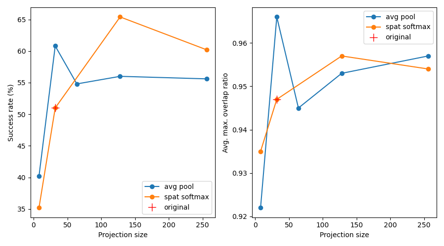

In this little experiment I wanted to investigate the role of [Spatial Softmax](https://arxiv.org/pdf/1509.06113) in [Diffusion Policy](https://arxiv.org/abs/2303.04137).

**TLDR**:
- Spatial softmax does not actually provide the diffusion model with what we would consider semantically useful keypoints.
  - I show animated visualizations to demonstrate this.
- (at least in my experimental setting) It's unclear whether it adds any value over global average pooling.
  - I show evaluation results for both.
- Tuning the number of keypoints (or global pooling feature size) seems to be a useful lever.
  - I show evaluation results for models trained with varying numbers of keypoints, including hints at improved performance over the original work.

## Quick intro to spatial softmax

This [blog post](https://radekosmulski.com/diving-into-diffusion-policy-with-lerobot/) nicely covers the role of spatial
softmax in diffusion policy (among other things). I'll try to summarize it briefly (and you may also find a well-documented [minimal implementation in the LeRobot code base](https://github.com/huggingface/lerobot/blob/1eb4bfe2e49d1af90275f44379fb249ed295b741/lerobot/common/policies/diffusion/modeling_diffusion.py#L316)):

1. In diffusion policy, visual inputs are processed with CNN backbones.
2. The final feature map with 512 channels (for ResNet at least) is projected to `num_keypoints` channels.
3. Then we apply a 2D softmax over each channel to get what's effectively a 2D probability distribution.
4. We compute the expected value of the image co-ordinates according to each of these probability distributions. Or if it helps to think about it this way: we compute the center of mass of the probability distributions (in units of image co-ordinates).



The purple points in the image above are actually expressed as image co-ordinates and fed into the diffusion policy as an image encoding.

## Does spatial softmax learn semantically meaningful keypoints?

I trained a model on the default settings for the PushT environment (where the goal is to push the T-shaped object onto the T-shaped goal region). I then ran a single rollout, extracted the spatial softmax layer's output in each step, and visualized the 32 keypoints as purple dots.

*(17 seconds for the full animation)*



_Note: the original diffusion policy work generates 16 step action horizons and rolls out 8 of those steps, discarding the rest, before generating another 16 steps. Here I use 16 step horizons but only roll out 1 step. This is to get a per-step animation of the keypoints._

As you can see, these keypoints mean nothing to us! They almost appear randomly scattered. But... maybe 32 keypoints is too many. Let's try with 8. Maybe the model will be forced to learn semantically meaningful keypoints.

*(30 seconds for the full animation)*



Nope!

To me, this makes a lot of sense. The spatial softmax output is just another hidden layer of activations deep within the forward pass of a neural network. There's no reason the model should learn to represent something that's concrete and understandable by humans. It's an abstract representation, just like other hidden layers in the network.

_Note: FYI, I'm not claiming that the Diffusion Policy authors suggested that spatial softmax should learn semantically meaningful keypoints._

## Is spatial softmax better than global average pooling?

Despite the results above, one could still argue that by computing an expectation value over image co-ordinates, we are at least grounding the model in co-ordinate space (if you look at [LeRobot's code](https://github.com/huggingface/lerobot/blob/1eb4bfe2e49d1af90275f44379fb249ed295b741/lerobot/common/policies/diffusion/modeling_diffusion.py#L363) you will see that the image coordinates are injected by design). Could this count for something?

So to test this I used a global average pooling layer instead of spatial softmax. In an attempt to aim for an apples to apples comparison I try a linear projection to get from the 512 channels of the ResNet feature map, to:

- 64 channels, with the reasoning that this is equivalent to the 32 keypoints, which each have an x and y component.
- 32 channels, with the reasoning that it matches the projection operation (same number of NN parameters) needed to get 32 keypoints.

There are two evaluation metrics on a per-episode basis:

- Maximum overlap with target. This ranges in [0, 1].
- Success: whether or not the maximum overlap is at least 95%.

Here are the metrics for 500 episodes worth of evaluation. For the success rate I added an extra row with confidence bounds (see [beta_distribution.md](./beta_distribution.md) for details on how I compute these).

<blank>|Spatial softmax (32 keypoints)|Avg. pool (64 channels)|Avg. pool (32 channels)
-|-|-|-
Average max. overlap ratio | 0.947 | 0.945 | 0.966
Success rate for 500 episodes (%) | 51.0 | 54.8 | 60.8
Beta distribution lower/mean/upper (%) | 48.8 / 51.0 / 53.2 | 52.6 / 54.8 / 57.0 | 53.4 / 55.6 / 57.8

I'll let you decide for yourself, but given what we have so far, I'd hedge towards average pooling as the better option.

## Bonus: Is 32 keypoints too much of a bottleneck?

If one has the idea that spatial softmax actually learns about semantically meaningful keypoints, they could be forgiven for using as little as 8 keypoints. But from running 500 evaluation experiments on trained models we see a steep drop in success rate:

_(spatial softmax w. 32 kp copied from above)_

<blank>|Spatial softmax (32 keypoints)|Spatial softmax (8 keypoints)
-|-|-
Average max. overlap ratio | 0.947 | 0.935
Success rate for 500 episodes (%) | 51.0 | 35.2
Beta distribution lower/mean/upper (%) | 48.8 / 51.0 / 53.2 | 33.1 / 35.3 / 37.4

_Note: The overlap metric doesn't drop as hard. What's happening is that the 8 keypoints model still does fairly well at pushing the T onto the target, but fails to finish the job by making the final adjustments to get the overlap above 95%. To see what I mean, please take another look at the gifs above._

Inspired (and somewhat surprised) by these results, I decided to try 128 and 256 keypoints:

_(32 and 8 copied from above)_

<blank>|Spatial softmax (256 keypoints)|Spatial softmax (128 keypoints)|Spatial softmax (32 keypoints)|Spatial softmax (8 keypoints)
-|-|-|-|-
Average max. overlap ratio |  0.9534 | 0.957 | 0.947 | 0.935
Success rate for 500 episodes (%) | 60.2 | 65.4 |  51.0 | 35.2
Beta distribution lower/mean/upper (%) | 58.0 / 60.2 / 62.3| 63.2 / 65.3 / 67.5| 48.8 / 51.0 / 53.2 | 33.1 / 35.3 / 37.4

I also tried global average pooling with feature sizes 256 and 128 (and 8 for good measure):

_(64 and 32 copied from the tables above)_

<blank>|Avg. pool (256 channels)|Avg. pool (128 channels)|Avg. pool (64 channels)|Avg. pool (32 channels)| Avg. pool (8 channels)
-|-|-|-|-|-
Average max. overlap ratio | 0.957 | 0.953 | 0.945 | 0.966 | 0.922
Success rate for 500 episodes (%) | 55.6 | 56.0 | 54.8 | 60.8 | 40.2
Beta distribution lower/mean/upper (%) | 53.4 / 55.6 / 57.8 | 53.8 / 56.0 / 58.2 | 52.6 / 54.8 / 57.0 | 53.4 / 55.6 / 57.8 | 38.1 / 40.2 / 42.4

For easier comparison, I plot the results below

_Note: the bottom axis is "projection size" referring to the projection layer applied to the CNN feature map_ 



To me, these results deliver a mixed message. Without doing more experiments, it's uncertain whether spatial softmax provides a clear advantage over global average pooling.

On the other hand, at least I can quite confidently say that tuning the image features size can be helpful.

---

## Appendix: Reproducibility

The experiments were conducted on [this branch of the LeRobot library](https://github.com/alexander-soare/lerobot/tree/experiment_diffusion_spatial_softmax) where I've added the visualization code (in `eval.py`) and the modifications needed to use global average pooling instead of spatial softmax.

The results were logged to WandB. You may view them [here](https://wandb.ai/alexander-soare/lerobot?nw=wk7ygethww).

The training commands were all variations of:

```python
python lerobot/scripts/train.py \
    hydra.job.name=$JOB_NAME \
    hydra.run.dir=/fsx/${USER}/outputs/train/$(date +'%Y-%m-%d/%H-%M-%S')_${JOB_NAME} \
    env=pusht \
    policy=diffusion \
    policy.global_pool_dim_out=256 \
    policy.spatial_softmax_num_keypoints=null \
    training.save_checkpoint=true \
    training.offline_steps=200000 \
    training.save_freq=20000 \
    training.eval_freq=10000 \
    training.log_freq=50 \
    eval.n_episodes=50 \
    eval.batch_size=50 \
    wandb.enable=true \
    wandb.disable_artifact=true \
    device=cuda \
    use_amp=true
```

where I've changed `policy.global_pool_dim_out` and `policy.spatial_softmax_num_keypoints` accordingly.

For the 500 evaluations used to produce the table, I sped things up a bit by using DDIM with 10 inference steps:

```bash
python lerobot/scripts/eval.py \
    -p checkpoint_dir/last/pretrained_model \
    eval.n_episodes=500 \
    eval.batch_size=50 \
    eval.use_async_envs=true \
    policy.noise_scheduler_type=DDIM \
    policy.num_inference_steps=10
```